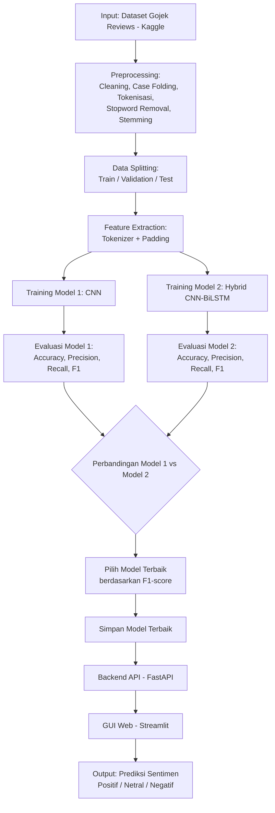
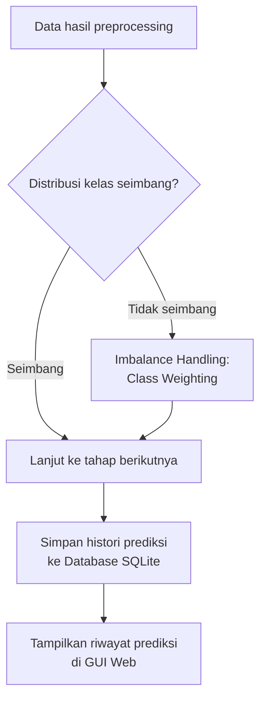

# Flowchart Proyek: Sentiment Analysis Gojek App Reviews
 1. Flowchart WAJIB (Alur Utama)

 2. Flowchart TAMBAHAN (Sunnah - Proses Ekstra)

 3. Keterangan Tambahan
- Proses **imbalance handling** dilakukan lewat `class_weight` pada saat training (lihat `notebooks/features.py`).
- Proses **database** dipakai untuk menyimpan histori setiap prediksi yang dilakukan lewat GUI (lihat `backend/app/core/database.py`).
- Ekstraksi fitur lanjutan (PCA/Chi-Square) bisa ditambahkan sebagai eksperimen tambahan jika ingin membandingkan representasi TF-IDF vs Embedding.
